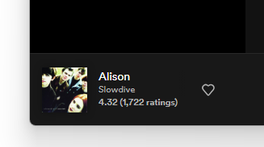

# Spicetify RateYourMusic Statistics

[Spicetify](https://github.com/spicetify/spicetify-cli) extension to display RateYourMusic song rating statistics under the current song details.

<p align="center">
  
</p>

# Installation

### Marketplace

You can easily install this extension from the [Spicetify Marketplace](https://github.com/spicetify/spicetify-marketplace).

### Manual

Download [rym.js](./rym.js?raw=1) and place it inside your Spicetify extensions folder:

| Platform            | Path                                   |
| ------------------- | -------------------------------------- |
| **Windows**         | `%userprofile%\.spicetify\Extensions\` |
| **Linux**/**MacOS** | `~/.config/spicetify/Extensions`       |

After putting the extension file in your extensions folder, run the following commands to enable the extension and apply the changes:

```
spicetify config extensions rym.js
spicetify apply
```
